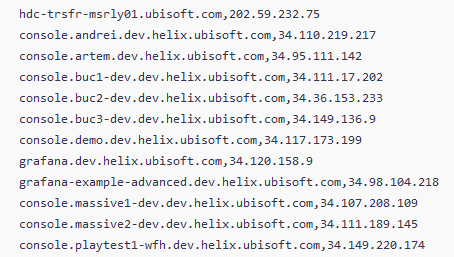

# General Idea

Company of interest - Ubisoft, and its subcompanies

What does the company do - It is a game industry company with various amounts of game titles being in work and under constant development

Goal - gather information using taught methods of OSINT (Open Source Intelligence), for footprinting and gathering entry points for a possible attack (not without a written permission).

Additional information - lately the company suffered massive losses in the share stakes price, as they proclaim a different vision of making games, that differs from other (successful) companies. [Companies politic regarding games has changed](https://insider-gaming.com/inside-ubisoft-from-low-morale-to-internal-tensions/). Additionally, the company was in a constant loss of money for around half a year. According to the information gathered from the latest (to this moment of investigation 20.02.2024) sales and earnings document [of 3rd quarter 2023-2024](https://staticctf.ubisoft.com/8aefmxkxpxwl/52CZPA6t2S0cuqWQNd7HFo/55f5a6a5ce31644077755e0b93233b04/Ubisoft_FY24_Q3_PR_English.pdf), the company has a got some good projects that worked well. Additionally, we can take a look at the [first quarter sales](https://staticctf.ubisoft.com/8aefmxkxpxwl/3bEvvJrB6zfTmZHf9uZEt5/dc3b3970124cc41be4cd92847f6e691d/Ubisoft_FY_24_Q1_Sales_EN_Final.pdf), which appeared to be a failure.

## Website information

[Main website](https://www.ubisoft.com/en-us/)

According to the source code of just the main site, what we can understand is that the company uses `React` to build the application. This can be seen through some of the JavaScript related functions:

Further along, we can take a look at the Careers page and see what the company is looking for and understand what they may be planning to do.

[Carreers website](https://www.ubisoft.com/en-us/company/careers)

According to what can be found in the latest jobs (as this is a game company and it has a lot of )

Additionally, there cam be found more information regarding interesting and important figures that play an important role in the company

Some examples:
- [Vice President of Human resources](https://www.linkedin.com/in/belen-essioux-trujillo/)
- [Technology Director](https://www.linkedin.com/in/lionel-bouchet-a8a8a095/)
- [President of audit and administration](https://www.linkedin.com/in/claudefrance/)

We can find the location of the main HeadQuarter, as the company also has a extensible amount of companies all over the world. Here is the link which also contains the e-mail, address (physical), and a phone number.

Also it was easy to find at least one of the few social media accounts, in this case Instagram: [Instagram account](https://www.instagram.com/lifeatubisoft/)

## More practical information

By using the `dig` command in Kali Linux, I managed to find resolve it to an IP address of a UDP Server

While having the main UDP servers IP might be useful, we still want to have a broader field of action, in case we plan to work with this company in terms of pentest or anything else.

By looking up host DNS records on the [Hacker Target](https://hackertarget.com/find-dns-host-records/) resource, I managed to find out that the company owns a lot of servers, which they apparently do not host themselves, but rent from the Amazon services. 

The IP resolved addresses gathered from the Hacker Target resource where mostly of a `216.x.x.x` form, `34.x.x.x`. That will be useful for further lookup in the other search engines or means of search.

Important note: The company is currently developing 2 or 3 massive projects which there is little information about, but one of those projects is a game from a known series and it might have a code name "Helix".

I managed to find some servers, that are probably used for corporate developing, and they are related to that project.

The [Shodan service](https://www.shodan.io/search?query=ubisoft&page=1), showed that Ubisoft uses a lot of servers from the Amazon company, situated mostly in USA, and some in India. Also, they have their own hosted servers in France, Canada, and Singapore

I also tried to take a look at the DNS addresses, and hence tried the `nslookup` command in Kali Linux, and down you can see the results of the search. It does not give a lot of precious information

I also tried to lookup additional information regarding registers of the servuces they have, via the `whois` command in Kali Linux, and a lookup on the internet using the same tool. The result, again, [does not seem to be a lot](https://www.whois.com/whois/ubisoft.com)

