# Lab 2 NSP

## Second: Scan a live machine either scanme.nmap.org or always.snwb.howest.be

### What ports are open?

Here is the result scan of open ports on the always.snwb.howest.be

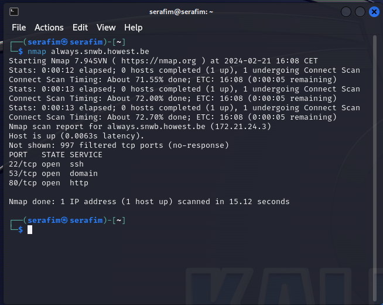

Here is the result scan of open ports on the scanme.nmap.org

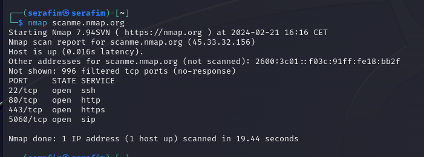

* Connecting to the VPN, and then get the ip address:
    * ip a

    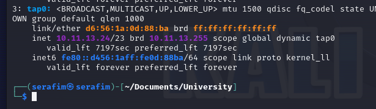

* Find the DNS Server:
    * dig always.snwb.howest.be
    * nslookup 10.11.12.6

    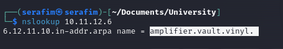

    amplifier.vault.vinyl.

* Find number of Live addresses

    * ip a

    We get our subnet mask 

    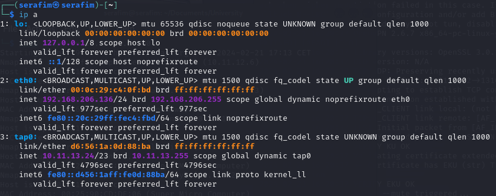

    * ipcalc 10.11.12.24/23

    We get the minimum one

    * sudo nmap -sn 10.11.12.1-100

    Then we get our result

    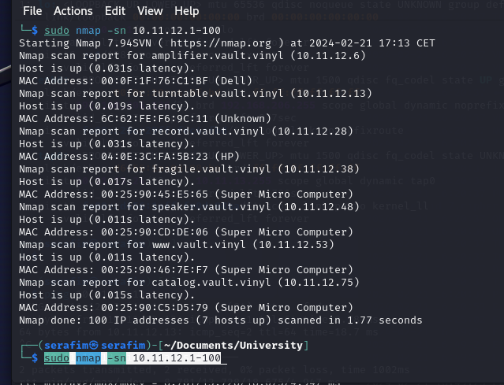

* Find the DomainController

    * since we had the DNS server, we run an nmap on that

    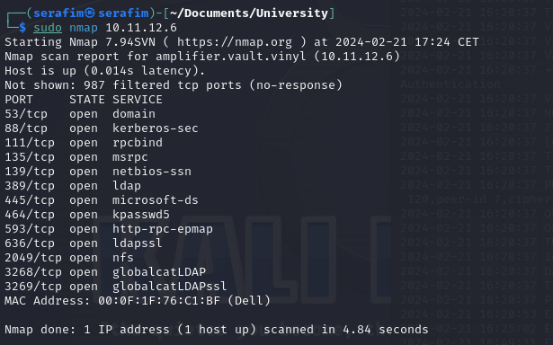

    * We see a 53 port, domain on it, so it works

* Hostname

    * one of the host, with the highest ip AND online, seems to be **catalog.vault.vinyl**, which is correct.

    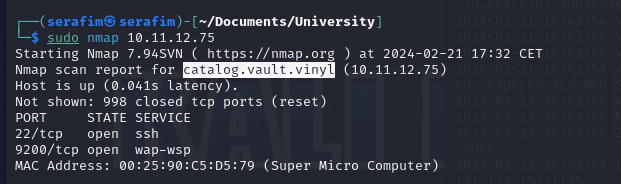

* Router

    * first thing that you can do, is `sudo nmap 10.11.12.1-100`, and then you can again see the the different IP addresses and their MAC addresses. Based on that, we can see the hardware which is there, like Dell, Super Micro Computer, etc. Hence, you can go and google all the possible answers, and then you will be able to understand that the router has the firmware `Unkown`, and then check the IP of that router (10.11.12.28), which is the correct answer.

    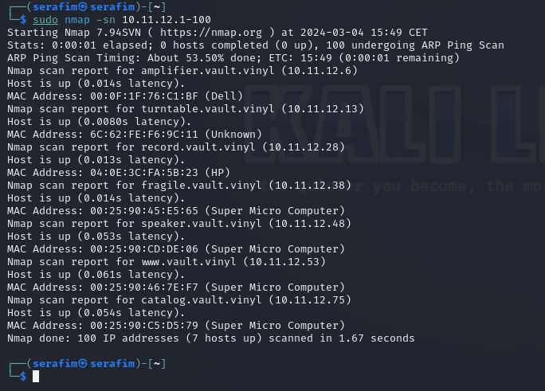

* Router version

    * Please enter the name of the software running on the router. - What you can do, is try and take a look at the nmap scan (for example `sudo nmap -O 10.11.12.1-100`), and then you can see a lot of information about the host itself, like OS, MAC, IP, and etc. But for the software, it does not really work, as if you say FreeBSD, then it is incorrect. What you can try and do, is go ahead and check the MAC address checker from wireshark for example (https://www.wireshark.org/tools/oui-lookup.html), and then enter the MAC address, and try and get a response.

    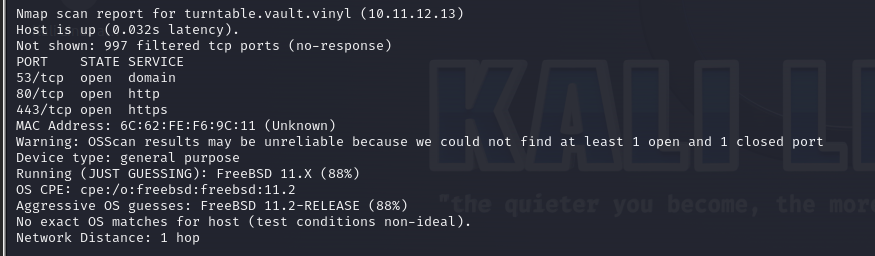

    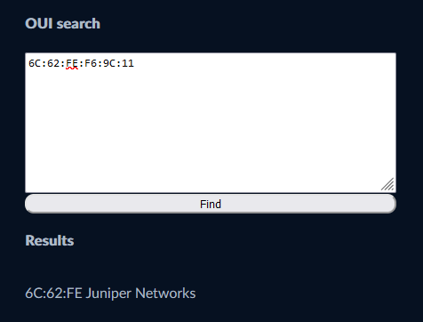

    * What you can then do, is go ahead an try to navigate to that IP address, and then you will be able to see a page with login credentials and etc. And at the bottom you can see what software it is running. It is essentially about the software, and not firmware and etc. Hence, the correct answer is `OPNsense`

    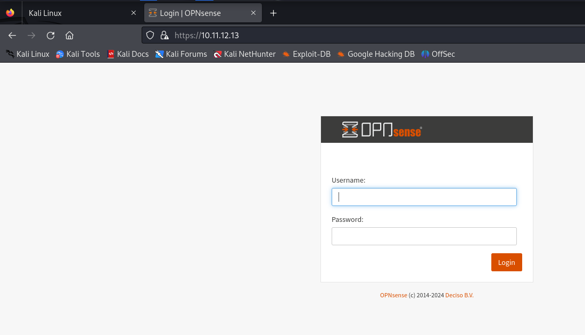

* HTTP

    * Based on port TCP/80, how many IP addresses are running a website? - to do that, you can run the nmap scan again over the 100 IP's, or specifically say that you want to grab only port 80 information, but from that scan, you can understand that there is 2 IP's having that port open, and hence running a website

    sudo nmap 10.11.12.1-100

    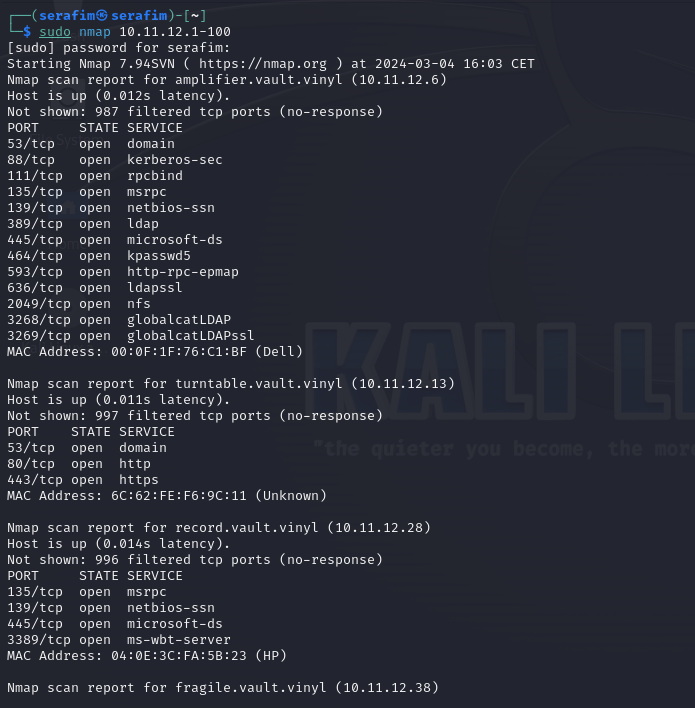

    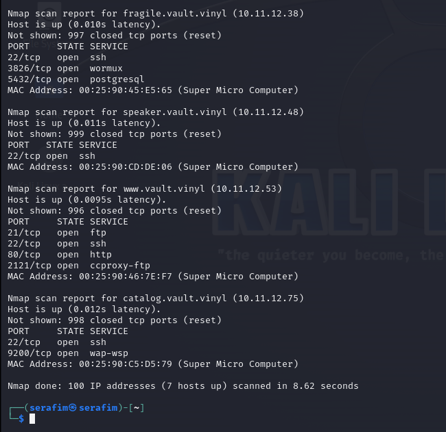

    Then you can just count the amount of open ports, and understand that the correct answer is `2`.

    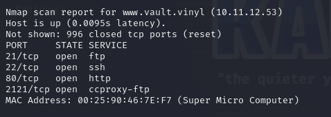

    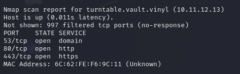

* HTTPS

    * Same as the previous one, but what you can do is look for 443 port open. You will find one out of 2 having that port open, which is the right answer.

* Windows Systems

    * A bit harder, try to identify the number of Windows systems on the network. When using VPN, the nmap -O switch might fail, so base your answer on finding the systems with the msrpc TCP port open. - To do this, what you can try, is again a simple nmap scan `sudo nmap -O 10.11.12.1-100`, and then you will be able to see a lot of possible IP addresses and then the actual OS or Software that is running on them. What you can then do, is try and just calculate how many of them contain the Windows system, which in this case is `2`, and it is the correct answer.

    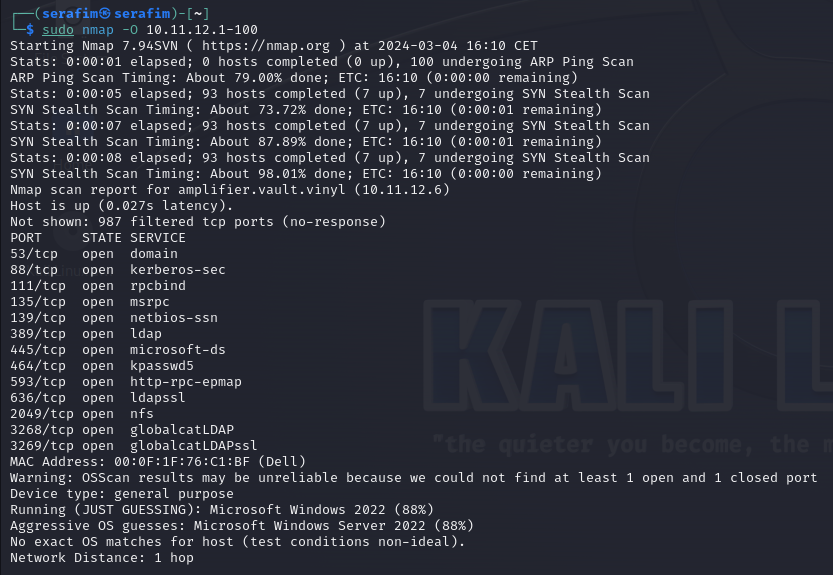

    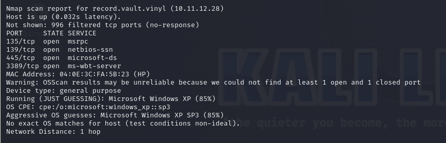

