# Lab 2 NSP

## Second: Scan a live machine either scanme.nmap.org or always.snwb.howest.be

### Machine: scanme.nmap.org 

#### What ports are open?

To scan for open ports on the machine, what we can do is:

* `sudo nmap scanme.nmap.org -p-` || `sudo nmap scanme.nmap.org` (as it takes a lot of time)

Here is the result scan of open ports on the scanme.nmap.org:

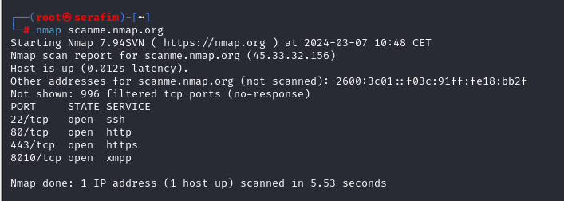

#### What services (+version) are running on the system?

To find information regarding the versions and services running on the system, we can do this:

* `sudo nmap scanme.nmap.org -sV`

Here is the result scan of versions of the services on scanme.nmap.org:

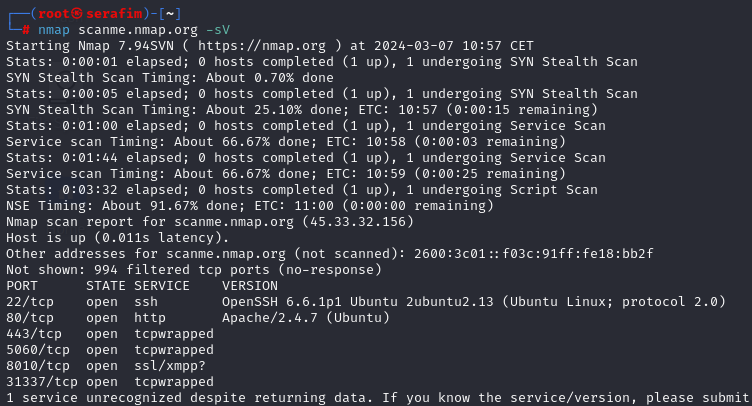

### Machine: always.snwb.howest.be

Here is the result scan of open ports on the always.snwb.howest.be

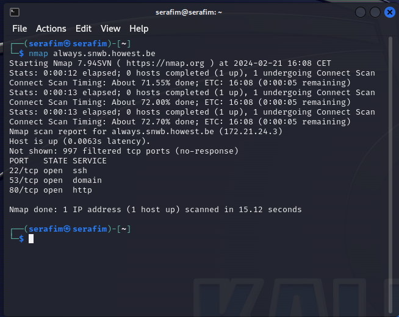

## Dashboard: Lab 2

### Your own address:

* To find out own address, we first connect to the VPN (`sudo openvpn <file>`, then `sudo dhcpclien tap0`), and after that, we can run the `ip a`, and get our own IP address from the network (tap0 infterface).

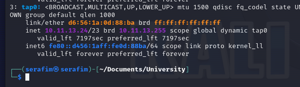

### Find the DNS Server:

To find the DNS Server, what we can try and do, is:

* `dig scanme.nmap.org`
* `nslookup 10.11.12.6`
* `cat /etc/resolv.conf`

This will give us (`dig`) the DNS server that is used to resolve the name. Then we can check the name of the DNS Server (`nslookup <ip>`) and get the name of that server (amplifier.vault.vinyl.), and also, we can take a look at the resolver configuration (`cat /etc/resolv.conf`), in order to understand the domain we are in, and the server that is used to resolve domain names. 

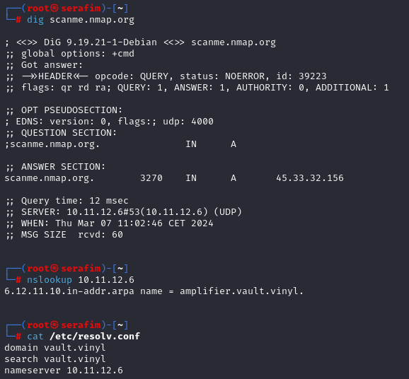

The correct answer is - `amplifier.vault.vinyl.`

### Find number of Live addresses

First, we need to find out in which network we are, and find the subnet delimiter. For that, run and check:

* `ip a`

We get our subnet mask.

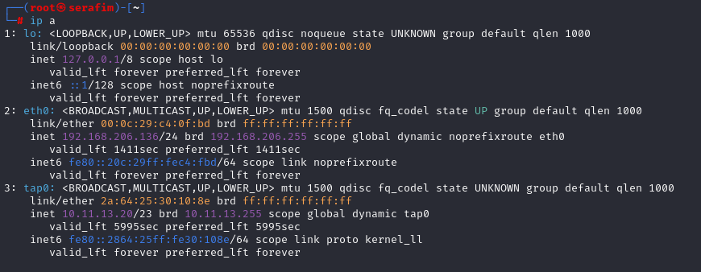

Now we need to calculate the range of IP addresses on the network. We can do that, using the:

* `ipcalc <ip>/<subnet>`

We get the various information about the network, and what we are intersted in, is the HostMin parameter

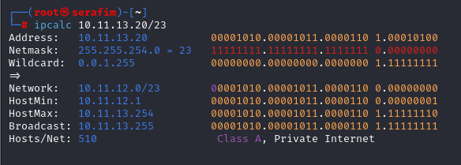

Then, we want to check how many of the IP addresses of our scope (100 IP) are up and running, starting from the lowest one, and then specifying the we need up to 100.

* `sudo nmap -sn 10.11.12.1-100`

Then we get our result

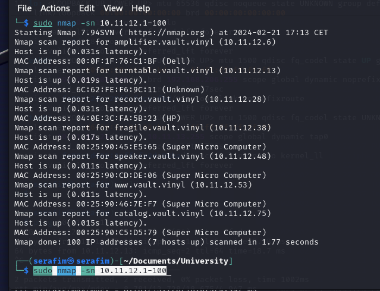

### Find the DomainController

To find the DC, first thing  that we can do, is take a look again at the DNS Server that is resolving our DNS. We can check the services running on that IP, and hence get an overview of what can be intersting about it.

* `sudo nmap 10.11.12.6`

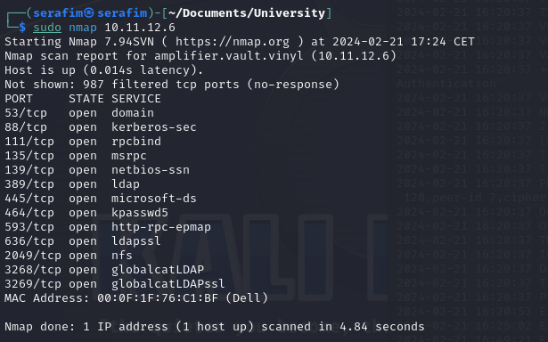

We can see a bunch of services running on it, like `nfs`, `ldap`, `domain`, `kerberos`, which might mean that this is a Domain Controller.

Hence, the IP address for the Domain Controller is - `10.11.12.6`

### Hostname

To find the hostname (FQDN) of the highest IP which is also online, we first need to check the IP's that are online (see previous hosts scan).

Then, we can see the highest IP being - `10.11.12.75`

To find some more information about it, we can run a scan on it aswell, or just check the previous results, as those also show the FQDN of those servers.

* `sudo nmap 10.11.12.75`

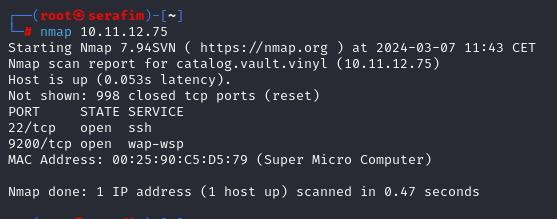

Hence, we can see that our answer is - `catalog.vault.vinyl`.

### Router

First thing that we can do to find the router on the network, again, is take a look at the result of scanning the hosts that are up, as they also show the MAC Address resolver of the hardware.

We can see something like `Dell`, `HP`, `Super Micro Computer`, etc.. But one of them says `Unknown`. If we start googling information about the different producers, we can notice that none of the known ones produce routers. Hence, the only option we are left for now, is the `Unknown` IP Address. What we can do with the MAC Address to check it again, is try and check the OUI resolver (from wireshark for example).

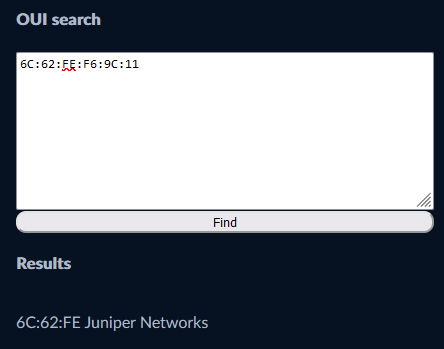

It says `Juniper Networks`, which means that is should be hardware for networks. Now we can say that the router on the network has IP - `10.11.12.13`

### Router version

To find the hardware that is running on the router itself, we can do a scan of open ports, and operating system, and services version, that are running on the system.

* `sudo nmap 10.11.12.13 -O -sV`

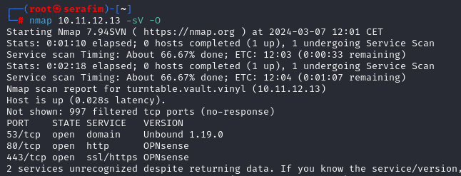

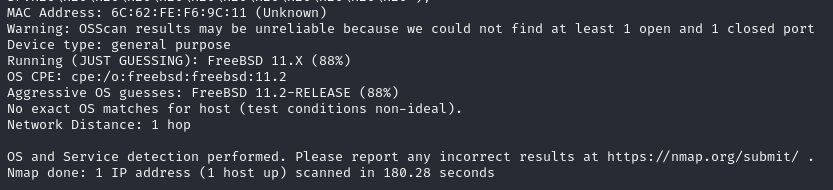

We can see that the router has ports open, 80 and 443, which means we have a web interface. But, apart from that, we can see the software, which is `OPNsense`. So, if you try to navigate to the `http://10.11.12.13`, you will be prompted with a login screen, which also states that it is using OPNsense.

Hence, our asnwer is - `OPNsense`

### HTTP

To get a list of hosts that have the port 80/tcp open, what we can do, is try and run a scan, over the 100 IP's:

* `sudo nmap 10.11.12.1-100 -p80` || `sudo nmap 10.11.12.1-100 -p80 | grep -i "open"`

Afterwards, we can just count (and see) the IP's that have that port open.

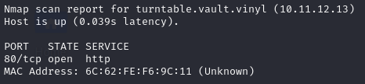

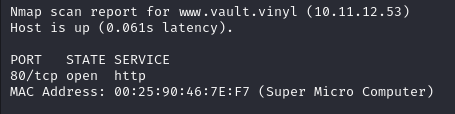

Based on the results, we can understand that the number of hosts having the port 80 open - is `2`.

### HTTPS

To get the amount of hosts that are running the 443/tcp open, we can repeat the command from the previous section, but specify that we need the port 443.

* `sudo nmap 10.11.12.1-100 -p443` || `sudo nmap 10.11.12.1-100 -p443 | grep -i "open"`

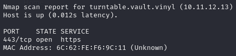

According to the result, we can understand that the number of hosts that have the port 443 open - is `1`.

### Windows Systems

To identify the number of Windows systems on the network, we can again, do a scan of the network, with a flag to try and resolve the name of the OS.

* `sudo nmap 10.11.12.1-100 -sS -O` || `sudo nmap 10.11.12.1-100 -sS -O | grep -i "windows"`

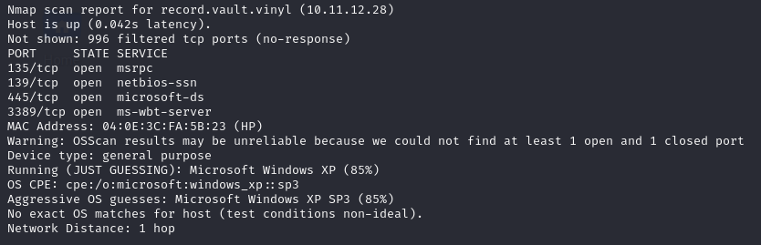

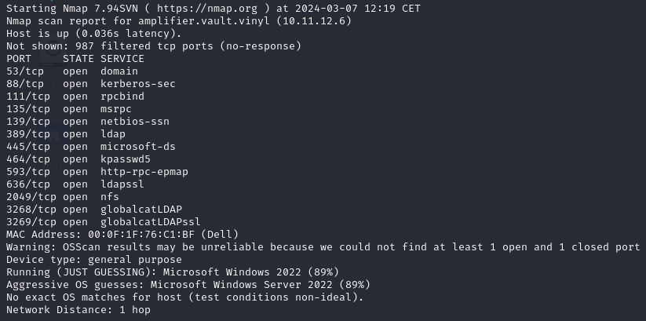

Hence, considering the results, we can say that the number of hosts running Windows OS - is `2`.

