# Scanning

# 10.11.12.6

FLAGS FOUND:
- LDAP service - shared directory (FLAG-6811)

## Nmap scanning

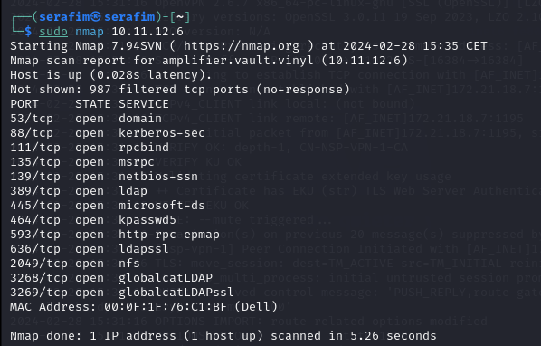

## nbts scan

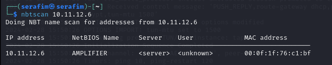

## ldap scan

sudo nmap --script=ldap-rootdse 10.11.12.6 

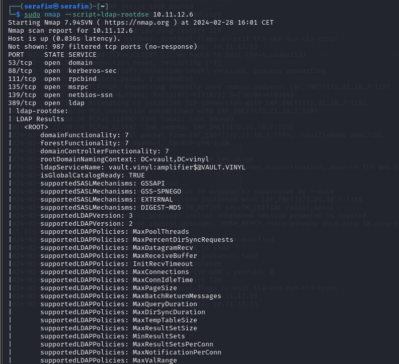

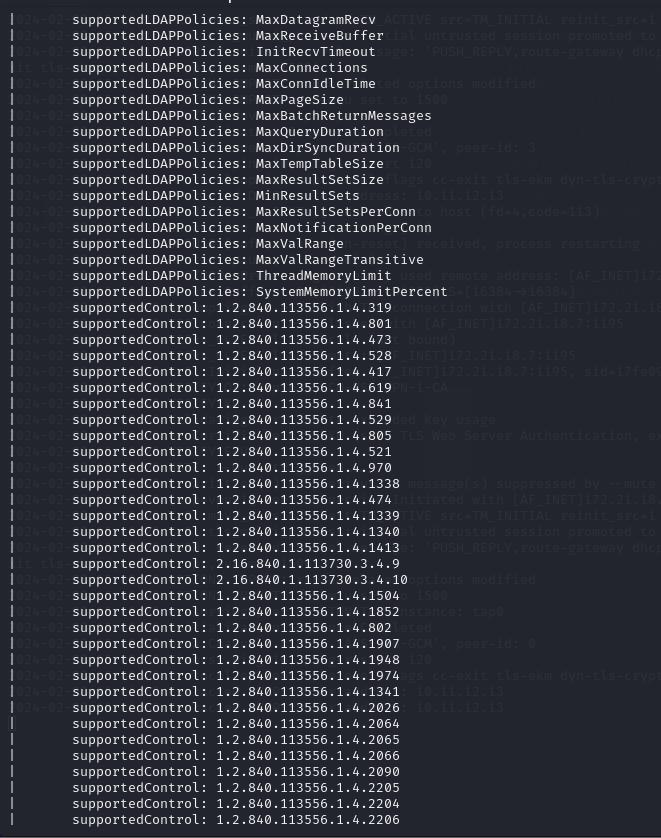

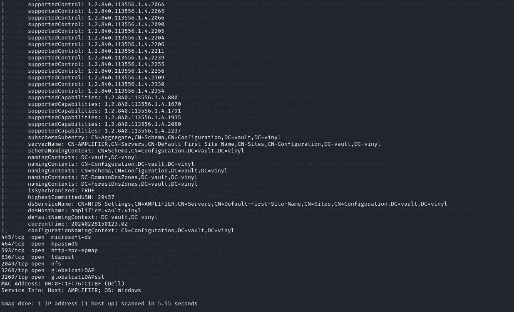

## RPC scan

You get this folder, because you are talking to the NFS service.

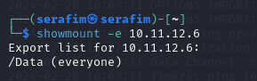

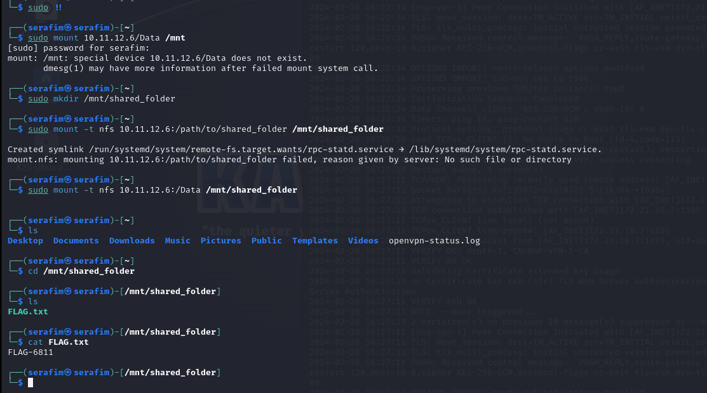

# 10.11.12.13

## NMAP

Port 53 open, meaning we have a DNS server (domain)

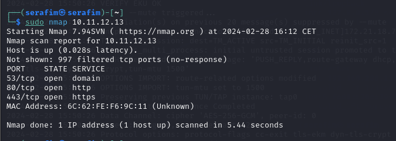

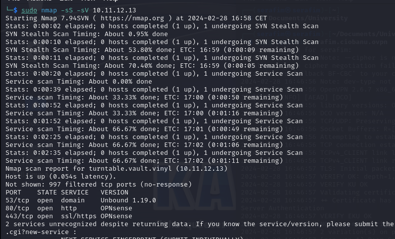

## Dig

dig any victim.com @10.11.12.13 - dig any victim.com @<DNS_IP>

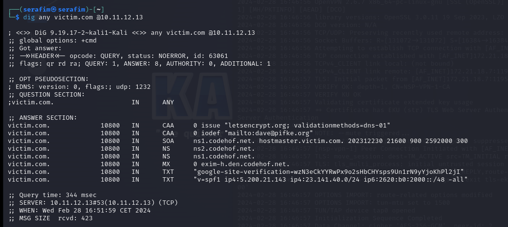

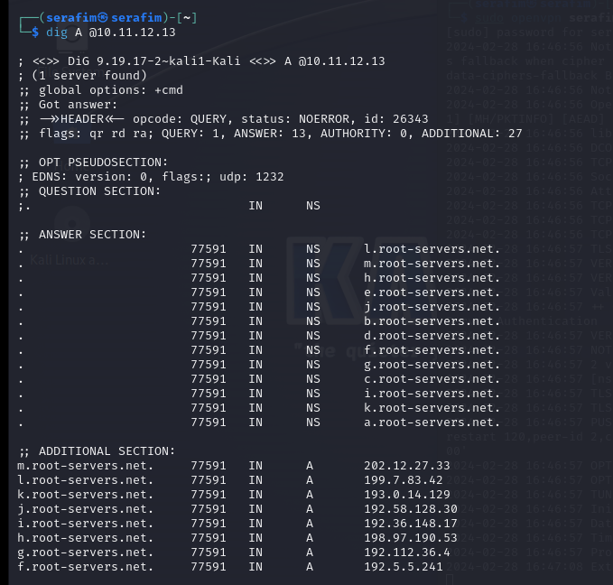

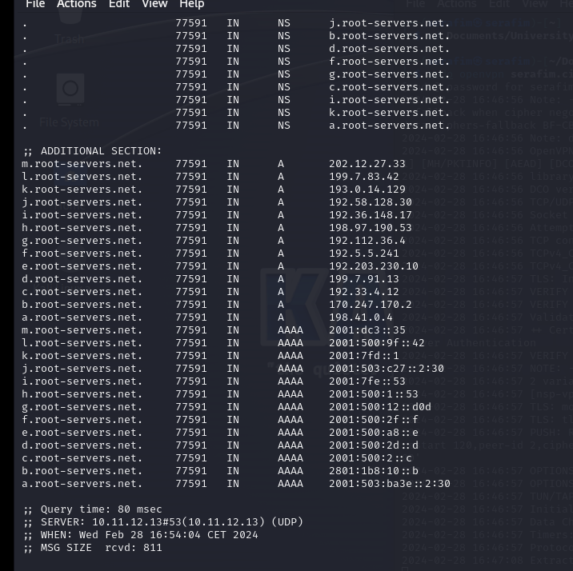