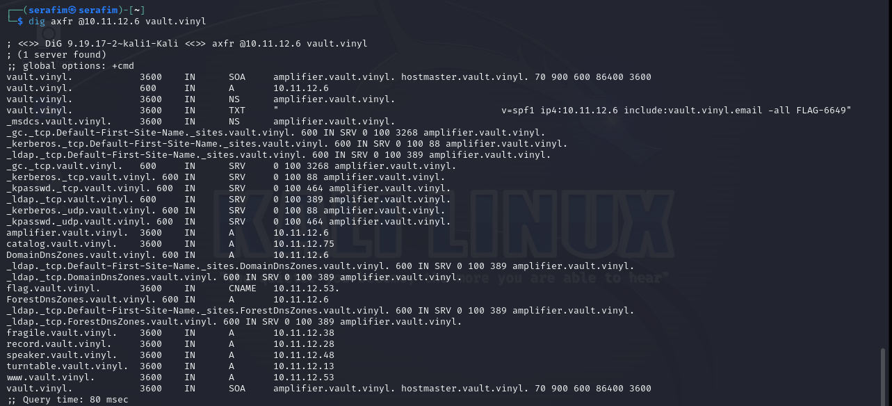
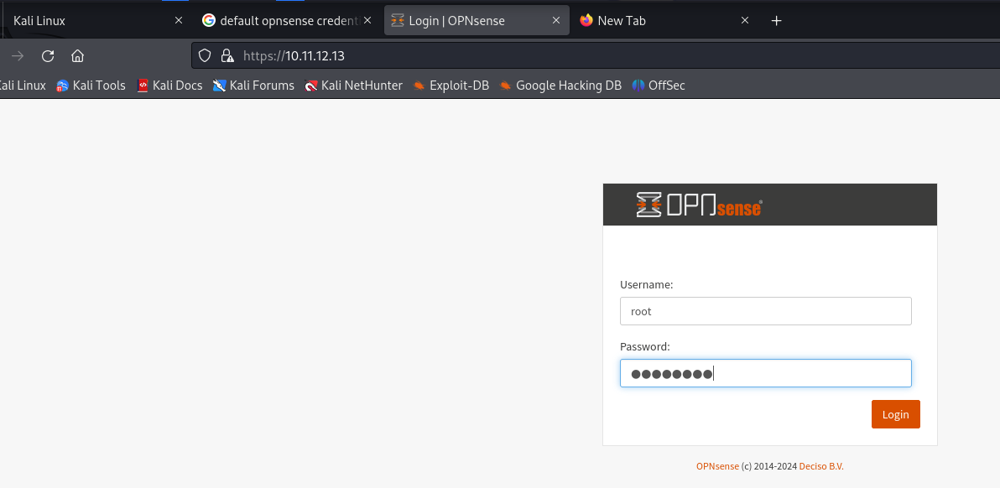
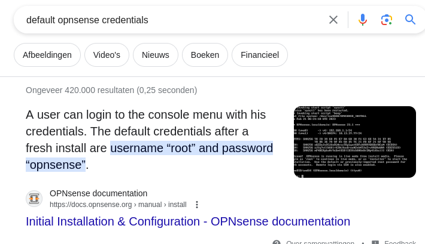
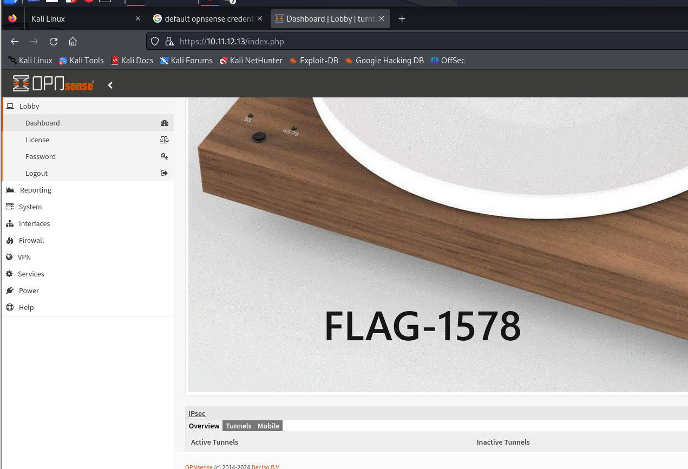
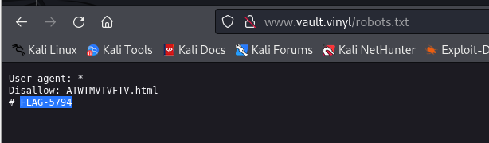
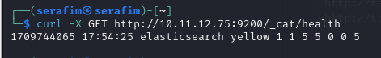
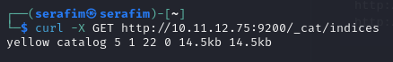
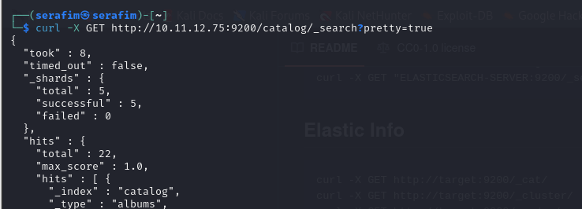
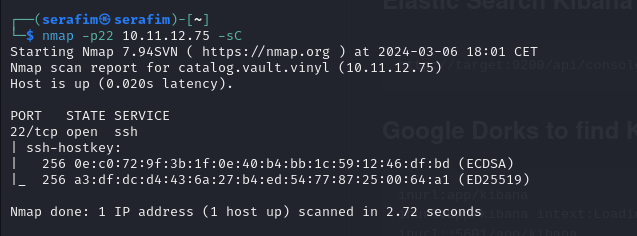

# Scanning

# 10.11.12.6

FLAGS FOUND:
- LDAP service - shared directory (FLAG-6811)
- DIG txt (banner) grabbing (FLAG-6649)

## Nmap scanning

## Dig

The command `dig axfr @10.11.12.6 vault.vinyl` initiates a DNS zone transfer request for the domain vault.vinyl using the AXFR protocol. This request is sent to the DNS server at IP address 10.11.12.6. The AXFR protocol is used to replicate DNS records across DNS servers, allowing for the efficient management of DNS zones without manual edits on multiple servers.

## nbts scan

## ldap scan

sudo nmap --script=ldap-rootdse 10.11.12.6 

## RPC scan

You get this folder, because you are talking to the NFS service.

# 10.11.12.13

FLAGS FOUND:
- OPNsense access - default credentials (FLAG-1578)
- OPNsense secure shell access - 5569 port, same credentials, shell, get the files (FLAG-1807)

## NMAP 

Port 53 open, meaning we have a DNS server (domain)

Port 80 open, running OPNsense, meaning we can navigate there.

## Dig

dig any victim.com @10.11.12.13 - dig any victim.com @<DNS_IP>

## Website

If we try to navigate to `http://10.11.12.13`, we get prompted with a OPNsense login shell

To try and login, we can google the default credentials for the OPNsense

So if we try them, we can get in, and get to the main dashboard, and find a flag.

# 10.11.12.53

FLAGS FOUND:

- Robots.txt - opened website on port 80 and then navigated to robots.txt (FLAG-5794)
- FTP access - (FLAG-5405)

## Website

## FTP

If you try to access the ftp via `ftp 10.11.12.53 2121`, then you can then authenticate as `anonymous` and then press enter to not enter a password. After that, you can do `ls`, and then see the `flag.txt`. Then you can do `get flag.txt`, and then on your host you can `cat flag.txt`, and you will be able to see the flag.

# 10.11.12.75

FLAGS FOUND:

- Find the elasticsearch indices (FLAG-7972)

